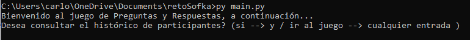
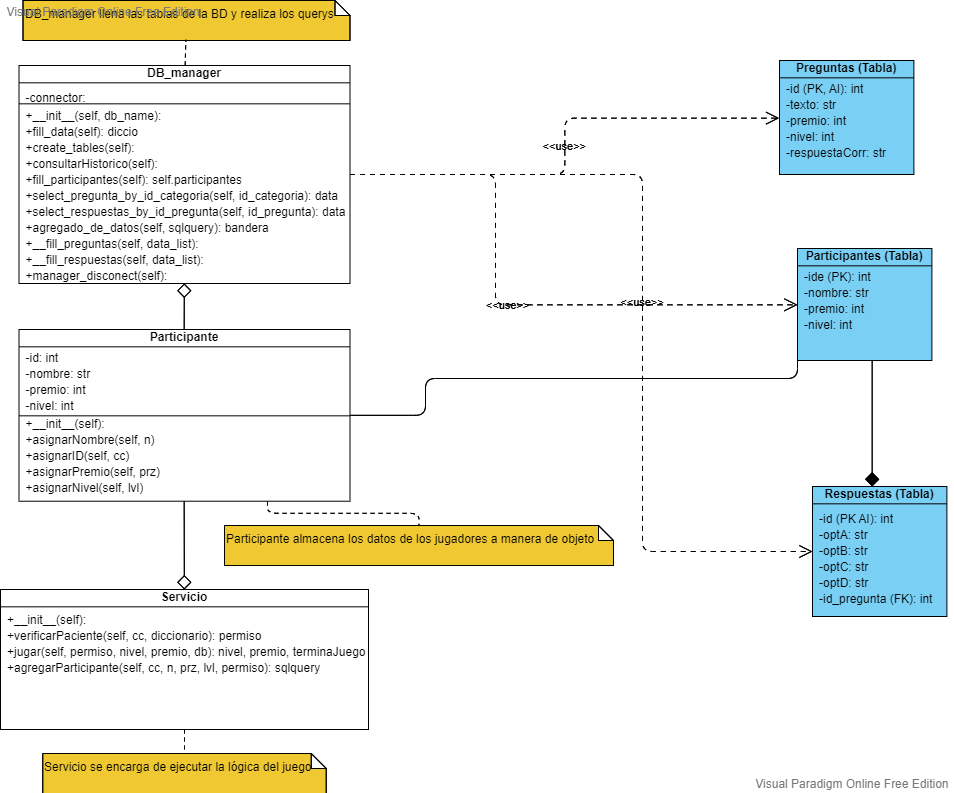

# Juego de cuestionario

En este proyecto se pretende realizar un juego de preguntas y respuestas con el fin de evaluar habilidades como:

* Modelamiento de objetos aplicando Programación Orientada a Objetos (POO)
* Creación de entidades
* Buenas prácticas de programación en la contrucción del caso de negocio
* Persistencia de datos

Para esto se definen las siguientes secciones:
  1. [Configuración inicial](#configuración-inicial)
  2. [Reglas de juego](#reglas-de-juego)
  3. [Requerimientos](#requerimientos)
  4. [Modelamiento de la aplicación](#modelamiento-de-la-aplicación)

## Configuración inicial

Para poder iniciar con el juego es necesario ubicar la consola de su predilección en la carpeta del poyecto y posteriomente escribir el siguiente comando:

Basados en Unix
```bash
user@pc1:~$ py main.py
```

Windows
```cmd
C:\Users\User1> py main.py
```

Posteriormente en la terminal que esté usando la aparecerá una serie de mensajes como los que se ven en la siguiente imagen (Esta prueba fue hecha desde el cmd):


En ese momento ya inicia el juego. Te deseo mucha suerte!

## Reglas de juego

El juego inicia preguntando al usuario si desea ver un histórico de los participantes del juego, despues de esto  se le solicita al usuario un id y un nombre de usuario con el cual al final del mismo se registrará su calificación. Si es la primera vez que corre el juego este creará un archivo en la carpeta raíz llamado `juegocuestionario.db` donde persistirán los datos de sus partidas, es **importante** tener en cuenta que cada que vuelva a iniciar el juego debe registrarse con otro id.

Una vez pase este registro iniciará con una pregunta aleatoria con 4 opciones disponibles donde solo una de ellas es la correcta. El juego consta de 5 niveles y usted siempre iniciará por el nivel mas bajo (nivel 0) y cada vez que responda correctamente obtendrá un puntaje (premio) y avanzará al siguiente nivel, si supera los 5 niveles ganará el juego, a medida que el usuario va avanzando los niveles, aumenta la dificultad de las preguntas, pero también es mayor el puntaje por pregunta acertada. Antes de cada ronda, usted puede elegir salir del juego, si elige esta opción usted conservará su puntaje, por el contrario si decide continuar y falla las respuestas su puntaje será cero.


## Requerimientos

Para usar este proyecto solo es necesario contar con python 3.10 instalado en su computadora y tener algún tipo de interfaz para ejecutar comandos de terminal de su sistema operativo.

## Modelamiento de la aplicación

A continuación se mostrará un diagrama donde se especifica brevemente las clases y las tablas utilizadas para esta aplicación.
